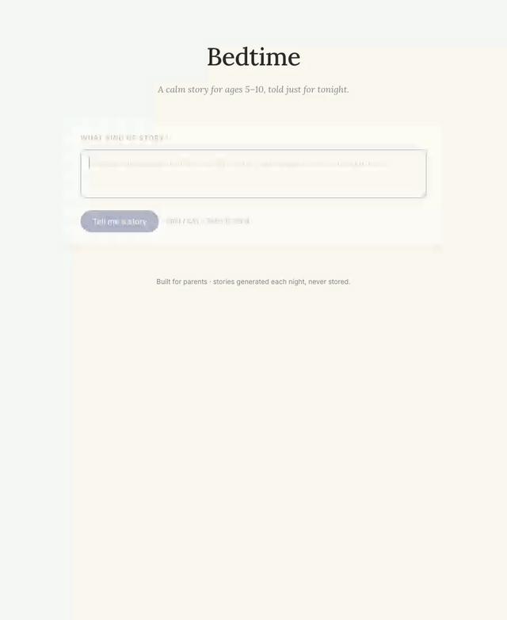

# Bedtime Story Generator

A multi-stage prompting pipeline that turns a one-line request
("a story about Alice and her cat Bob") into a calming,
age-appropriate bedtime story for ages 5-10. Includes an LLM
judge with a refinement loop and an interactive feedback step.

Built on `gpt-3.5-turbo` (fixed by assignment requirement).

<p align="center">
  
</p>

## Example

**Prompt:** *A story about Alice and her cat Bob, who finds a quiet star in the garden.*

> ### Alice and Bob's Quiet Star
>
> In a cozy little house, Alice and her cat Bob lived together as best friends. They spent their days exploring the garden and playing in the sun.
>
> One evening, as they were strolling through the garden, Bob suddenly stopped and stared up at the sky. Alice followed his gaze and saw a quiet star twinkling in the distance, filling her with wonder.
>
> Together, Alice and Bob decided to sit under the quiet star and enjoy its peaceful light. They talked about their day and shared stories until they felt warm and content.
>
> As the night grew darker and the quiet star shone brighter, Alice and Bob curled up together, feeling safe and sleepy. The garden whispered lullabies as they drifted off into dreams.

*Auto-categorised as `friendship` · ~52s read-aloud · passed the editor on the first try (no refinements needed). Generated end-to-end in ~12s with four LLM calls (categorise → plan → tell → judge).*

## Project layout

```
backend/    Python pipeline, FastAPI server, tests
frontend/   Single-page UI (index.html, styles.css, app.js)
```

All commands below assume you're at the project root.

## Setup

```bash
pip install -r backend/requirements.txt
cp .env.example .env
# edit .env with your OPENAI_API_KEY
```

The app loads `.env` automatically via `python-dotenv`. Either project root
or `backend/` works — `find_dotenv` walks up from `backend/llm.py`.

## Run — Web (recommended)

```bash
python backend/server.py
# then open http://127.0.0.1:8000
```

Single-page app with a live progress timeline that lights up as each
pipeline stage finishes (categorize → plan → write → judge → polish).
Story renders with title, body, and a read-aloud time chip. A tweak
input below lets you say *"make it shorter"*, *"more about Bob"*, or
*"less scary"* and the story re-renders in place.

Streaming is implemented with Server-Sent Events; the pipeline's
existing `on_event` callback feeds straight into the SSE queue. The
FastAPI server mounts `frontend/` at `/static` and serves `index.html`
at `/`.

## Run — CLI

```bash
python backend/main.py
```

## Test

```bash
cd backend && pytest
```

All tests mock `llm.call_model`, so no real API calls are made.

Coverage:

- `test_models.py` — dataclass defaults, strict-pass logic, critique ordering
- `test_utils.py` — reading-time estimate, length mapping, character formatting
- `test_prompts.py` — every template renders with required placeholders
- `test_judge.py` — JSON parsing, missing/out-of-range fields, override-the-lying-model, retry-on-bad-JSON, safe failing report after 2 bad responses
- `test_pipeline.py` — passes on first judge, refines on failure, caps at 2 refinements, event ordering, categorizer fallbacks
- `test_server.py` — root + static assets, SSE event streaming for `/api/generate` and `/api/tweak`, refine-on-fail in the stream, input validation, LLM error surfaced as event

## Quality eval

Unit tests verify mechanics; an offline eval suite verifies *output quality*.

```bash
cd backend
python evals/run_evals.py                                  # full suite
python evals/run_evals.py --json evals/last_run.json       # snapshot
```

The runner pushes a 10-prompt set (six categories, named/unnamed
characters, ambiguous input, one adversarial "scary fight" prompt) through
the full pipeline and reports per-dimension judge averages, pass rate,
refinement count, and latency. Costs ~$0.05 and runs in 3–5 minutes.

This is what catches a bad prompt edit *before* it ships. See
[`backend/evals/README.md`](./backend/evals/README.md) for the prompt set
rationale and a sample report.

## Architecture


Legend: blue = LLM call · amber = user-facing I/O · green = terminal state.
Full diagram (with extended commentary and an ASCII version) lives in
[`diagram.md`](./diagram.md).

## Design

The pipeline has six stages:

1. **Categorize** — classify the request into one of six story types
   (`adventure`, `animals`, `fairy_tale`, `friendship`, `silly`,
   `calming`) and extract named characters, themes, and a tone hint.
2. **Plan** — build a 4-beat outline: SETUP → SPARK → RESOLUTION →
   WIND_DOWN. The 4th beat is enforced as a calming wind-down — this
   is the bedtime-specific differentiator.
3. **Tell** — write the full story from the outline with
   category-tailored tone, a banned-content list, and a target word
   count derived from `target_length`.
4. **Judge** — score across 7 dimensions (`age_appropriateness`,
   `bedtime_suitability`, `narrative_coherence`, `vocabulary_level`,
   `safety`, `ending_calmness`, `character_consistency`). All must
   score ≥ 4/5 to pass.
5. **Refine** — if the judge fails, the storyteller revises with
   targeted edits driven by the per-dimension critique. Capped at
   2 refinements.
6. **User feedback** — interactive: accept the story, or describe a
   tweak that runs through a dedicated user-tweak prompt.

### Why multi-stage with `gpt-3.5-turbo`?

We're constrained to `gpt-3.5-turbo` (per the assignment).
Single-shot prompting on this model yields uneven structure and weak
endings — exactly the things that matter most for bedtime. Splitting
into categorize → plan → tell → judge gives each call a smaller,
well-scoped job, which the model handles more reliably than one
large request.

### Why `ending_calmness` as its own judge dimension?

Generic kid-story prompts end with energy ("...and then they all
cheered!"). For bedtime, the last paragraph needs to slow down and
point toward sleep. Making this a stand-alone judge dimension means
the refinement loop has a specific lever to pull when the ending
drifts off-target.

### Why cap refinements at 2?

Empirically, one refinement clears the threshold most of the time. A
second is occasionally needed. Beyond two, marginal quality gains are
small relative to latency and API cost.

## Files

```
backend/
  main.py          — CLI entry point + "what I'd build next" comment
  server.py        — FastAPI web app (SSE streaming for live progress)
  pipeline.py      — categorize → plan → tell → judge → refine orchestration
  prompts.py       — all prompt templates, centralized
  judge.py         — judge invocation, JSON parsing, threshold logic
  llm.py           — OpenAI client wrapper (gpt-3.5-turbo, fixed) + dotenv
  models.py        — typed dataclasses
  utils.py         — reading-time, character formatting, length mapping
  requirements.txt
  tests/           — pytest suite (LLM mocked at llm.call_model boundary)
frontend/
  index.html       — single-page UI
  styles.css       — calm bedtime palette + responsive layout
  app.js           — SSE streaming client + story renderer + tweak handler
diagram.md         — system block diagram (mermaid + ASCII)
diagram.png        — rendered mermaid diagram
README_USAGE.md    — this file
.env.example
```
