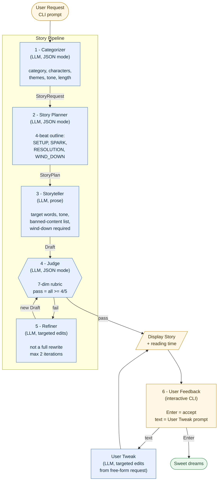

# System Block Diagram

## Mermaid



Legend: blue = LLM call · amber = user-facing I/O · green = terminal state.

## ASCII

```
                       ┌────────────────────────┐
                       │   User Request          │
                       │   (CLI prompt)          │
                       └────────────┬────────────┘
                                    │ free-form text
                                    ▼
                       ┌────────────────────────┐
                       │   1. Categorizer        │
                       │   (LLM, JSON mode)      │
                       │                         │
                       │   → category            │
                       │   → named characters    │
                       │   → themes              │
                       │   → tone_hint           │
                       │   → target_length       │
                       └────────────┬────────────┘
                                    │ StoryRequest
                                    ▼
                       ┌────────────────────────┐
                       │   2. Story Planner      │
                       │   (LLM, JSON mode)      │
                       │                         │
                       │   4-beat outline:       │
                       │     • SETUP             │
                       │     • SPARK             │
                       │     • RESOLUTION        │
                       │     • WIND_DOWN  ◄──── enforced as the bedtime-specific beat
                       └────────────┬────────────┘
                                    │ StoryPlan
                                    ▼
                       ┌────────────────────────┐
                       │   3. Storyteller        │
                       │   (LLM, prose)          │
                       │                         │
                       │   target words, tone,   │
                       │   banned-content list,  │
                       │   wind-down required    │
                       └────────────┬────────────┘
                                    │ Draft
                                    ▼
                       ┌────────────────────────┐
                       │   4. Judge              │ ◄────────────┐
                       │   (LLM, JSON mode)      │              │
                       │                         │              │
                       │   7-dim rubric:         │              │
                       │   age_appropriateness   │              │
                       │   bedtime_suitability   │              │
                       │   narrative_coherence   │              │
                       │   vocabulary_level      │              │
                       │   safety                │              │
                       │   ending_calmness       │              │
                       │   character_consistency │              │
                       │                         │              │
                       │   pass = all >= 4/5     │              │
                       └────┬───────────────┬────┘              │
                            │ pass          │ fail              │
                            ▼               ▼                   │
                       ┌─────────┐     ┌─────────────────┐      │
                       │ Display │     │  5. Refiner     │ ─────┘
                       │  Story  │     │  (LLM, targeted │   max 2 iterations
                       │  + read │     │   edits, NOT a  │
                       │   time  │     │   full rewrite) │
                       └────┬────┘     └─────────────────┘
                            │
                            ▼
                       ┌────────────────────────┐
                       │   6. User Feedback      │
                       │   (interactive CLI)     │
                       │                         │
                       │   Enter   → accept      │
                       │   text    → User Tweak  │
                       │             prompt re-  │
                       │             applies     │
                       │             targeted    │
                       │             edits       │
                       └────────────────────────┘
```

## Key design choices

- **WIND_DOWN as a first-class beat AND a judge dimension.** A generic
  children's-story prompt will end with cheering or action. Bedtime stories
  must end with the world quieting and a closing line that points toward
  sleep. We enforce this both upstream (in the planner) and downstream (in
  the judge), so the refinement loop has a specific target if it drifts.

- **Multi-stage decomposition.** We are constrained to gpt-3.5-turbo per the
  assignment. Single-shot prompting on this model produces uneven structure.
  Splitting into categorize → plan → tell → judge gives each call a smaller,
  well-scoped job and yields more reliable structure than one big prompt.

- **Refinement is targeted, not regenerative.** The refiner prompt receives
  the prior draft + the per-dimension critique block sorted lowest-score
  first, and is instructed to make edits rather than rewrite. This preserves
  what the judge already approved.

- **Judge JSON parser is strict.** Even if the model claims `overall_pass:
  true`, the parser overrides to `false` if any dimension scored below the
  threshold. Missing or malformed dimensions default to score 3 (failing) so
  the refinement loop is forced rather than silently passing through.

- **User feedback uses a different prompt than auto-refinement.** The auto
  refiner addresses an editor's structured rubric; the user-tweak prompt
  treats free-form natural-language requests as the source of truth. Mixing
  them in one template produced muddled edits.

- **Iteration cap of 2.** Empirically clears the threshold the vast majority
  of the time. Beyond 2, marginal quality gains are small relative to
  latency and API cost.
```
